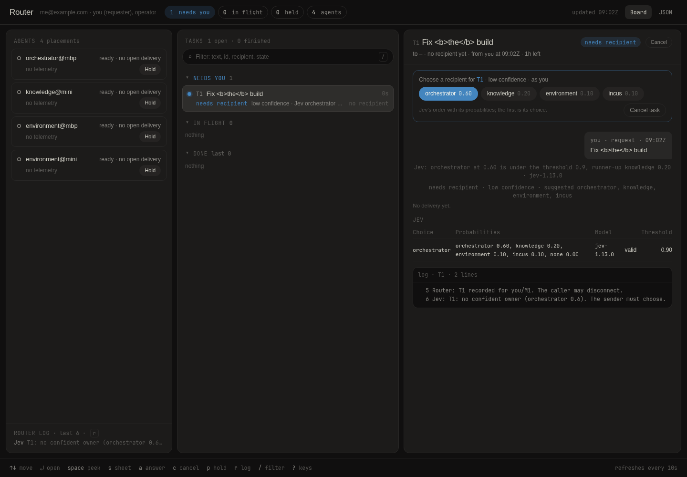
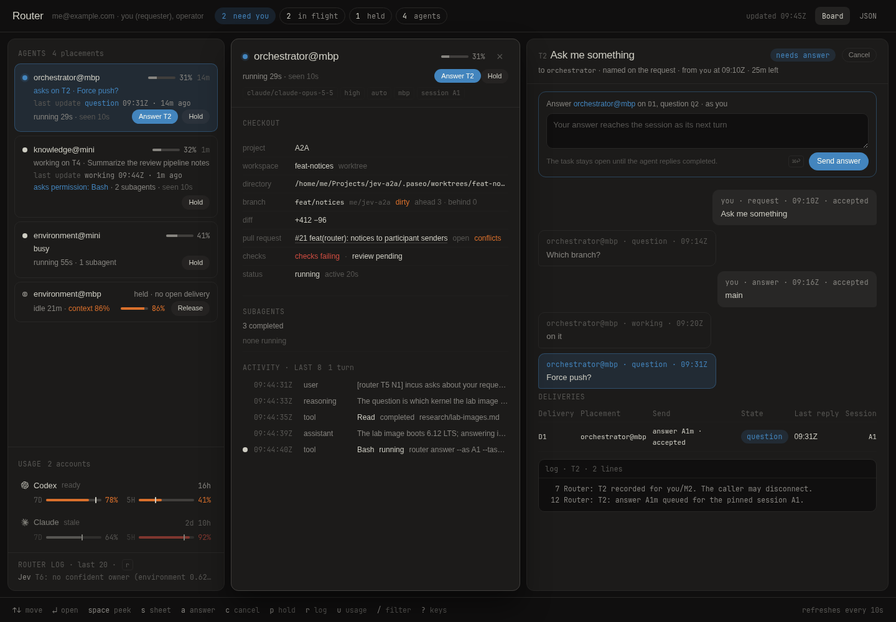
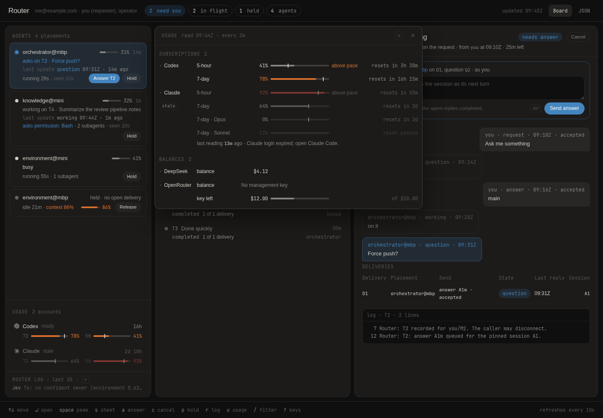

# Jev router

A small router that sends work between coding agents running in
[Paseo](https://paseo.sh) sessions on several machines, and keeps one record
of what was asked, who took it, and what came back.

> [!NOTE]
> A personal prototype, built for one person's machines and published as a
> worked example. It is not a product: no releases, no support, and the
> contracts can change between commits.



```sh
router submit "Is this machine current with merged main of the dotfiles baseline?"
```

Agent-to-agent messaging is prompt sending. The router sends the same prompt
a person would type into an agent's session, and adds the two things that
person would otherwise carry in their head:

- **An envelope.** A task ID, the command the agent runs to reply, a key so
  nothing runs twice, and a check that the session is idle so nothing
  already running is interrupted.
- **A record.** One journal of what was sent to which session, what came
  back, and what is still waiting on someone.

Five words carry the rest of this file. A **participant** is an agent or a
service with a stable id, one or more hosts and a **responsibility text**:
an ownership rule with examples, and all that Jev reads. A **placement** is
a participant on one host (`coder@laptop`), with one current Paseo session.
A **principal** is who acts on the record. A person is a requester, who
submits, or an operator, who settles what the router cannot confirm; a
participant acts through its session. A **delivery** is one request on its
way to one placement. The [spec's vocabulary](docs/research/jev-router-spec.md#vocabulary)
has more.

When a request names no recipient, Jev (a
[TypeSafe](https://typesafe.ai) System One model) reads each participant's
responsibility text and picks one. If no owner is clear, the router hands
the choice back to the sender instead of guessing. This is where the router
earns its place: requests that name nobody; sends nobody is watching, from a
laptop that will be asleep when the answer comes; and "what did I start,
where is it, what needs me" from any device.

The router does not orchestrate, run workflows, or hold a session until a
task finishes. How the work gets done belongs to the agents. Typing into a
session you are already looking at needs none of this.

## How a request travels

1. The router records the request as a task.
2. Jev chooses a participant among those the sender may address, or `--to`
   names one.
3. The router sends the prompt to that participant's session on each of its
   hosts, when the session is idle. A busy session gets it the next time the
   router looks and finds it idle ([when it looks](docs/operating.md#when-the-router-looks)).
4. The agent does the work and replies with the command from the envelope:
   `router reply --task T1 --in-reply-to <message> --kind completed --text "..."`.
5. `router status T1` shows the result: here, `1 of 1 completed`, with the
   reply.

## Quick start

On the host that runs the router you need Node 26 (it runs the TypeScript
directly), pnpm, and a Paseo daemon with at least one agent. A TypeSafe API
key is needed only for requests that name no recipient.

```sh
git clone https://github.com/skhlo/jev-a2a && cd jev-a2a/router
pnpm install
printf '#!/bin/sh\nexec node --no-warnings %s/src/cli.ts "$@"\n' "$PWD" \
  > ~/.local/bin/router && chmod +x ~/.local/bin/router   # ~/.local/bin exists and is on PATH

mkdir -p ~/.config/jev-router
cp config.example.json ~/.config/jev-router/config.json
cp secrets.env.example ~/.config/jev-router/secrets.env && chmod 600 ~/.config/jev-router/secrets.env
```

The example is one host, `laptop`, with two agents, `coder` and `notes`.
Edit it to match yours:

- `hosts`: your host's name, with its daemon's websocket URL;
- `participants`: your agents, each with a responsibility text, and the
  same names under `permissions`, which say who may address whom;
- `agents`: the Paseo agent id of each `participant@host`, from
  `paseo agent ls -g --json`, or `terminal:<id>` for Claude Code (or,
  named in `terminals`, Codex) in a Paseo terminal;
- `secrets.env`: `TYPESAFE_API_KEY` if you have one. Each other host's
  token (`ROUTER_TOKEN_MINI` for `mini`) is added by `router host setup`,
  below.

Every key, its default and what is refused is in
[docs/configuration.md](docs/configuration.md); `policy.deadline` is in
milliseconds. Then send something to a named participant and read the
record:

```sh
router submit --to coder "Reply with the word pong."
router status            # T1 ... → coder · Reply with the word pong.
router status T1         # the delivery, the session it went to, and the reply when it comes
```

The agent's session receives the prompt with its envelope and answers with
`router reply ...`; once it has, `router status T1` shows `1 of 1
completed` and the reply text. If the session was busy, the task waits and
`router run` makes another pass by hand.

For the board, run the daemon:

```sh
router serve             # events on 127.0.0.1:7677, board on http://127.0.0.1:7678
```

Other machines join through `hosts` entries of the form `ssh://<host>`,
with `serve.listen` on an address they can reach. Their agents run the
same `router`, from a checkout that needs no `pnpm install`. On the router
host, one command installs it there over that ssh; the host needs Node 26
and git:

```sh
router host setup mini
```

A host's token is `ROUTER_TOKEN_<HOST>` in the router's `secrets.env`;
setup adds it when it is missing, and restarts the `jev-router` service
whenever `serve` does not take it yet. On the host it checks out this
repository in `~/.local/share/jev-router/repo` at the commit `serve` runs,
writes the `router` wrapper, and writes `~/.config/jev-router/secrets.env`
there: `ROUTER_URL`, and the token as `ROUTER_TOKEN`. It ends with
`router check` there. Run it again after the router moves to another
commit; to change a token, delete its line from the router's `secrets.env`
first.

With no configuration on that host (keep no `config.json` there),
`router` sends `reply`, `submit`, `answer` and `choose` to the router as
the agent's session. `router check` there says whether the router answers,
takes the token and runs the same commit; a reply also warns when the
commits differ. To keep `serve` running on the router host, install it as
a user service ([docs/operating.md](docs/operating.md#router-serve-as-a-service)).

## Commands

| Command                                              | What it does                                                                                                 |
| ---------------------------------------------------- | ------------------------------------------------------------------------------------------------------------ |
| `router submit [--to P [--hosts a,b]] <text>`        | Record a request and deliver it; without `--to`, Jev picks; `--hosts` narrows a participant on several hosts |
| `router status [<task>]`                             | The record: every task, or one task with its deliveries and log                                              |
| `router needs-you`                                   | Decisions waiting on you                                                                                     |
| `router choose --task T --to P`                      | Name the recipient when the router handed the choice back                                                    |
| `router answer --task T --question Q --text ...`     | Answer a question an agent asked                                                                             |
| `router cancel <task>`                               | Cancel a task whose work has not reached anyone yet                                                          |
| `router run`                                         | Observe the sessions and deliver what is eligible, once                                                      |
| `router serve`                                       | Accept events from other hosts; serve the board; keep looking                                                |
| `router host setup <host>`                           | Install or update `router` on a host reached over ssh, with its token, and check it there                    |
| `router roster repoint <participant@host> <session>` | Point a placement at its new Paseo session, restart `serve` and see it bound                                 |

Agents use `router reply`. `router observe <placement> --hold` keeps the
router from sending to a session a person is typing in; `router resolve`
lets an operator settle a send the router could not confirm; `router eval`
judges a labeled request set; `router usage` reads this host's usage
accounts once and prints them. `router --help` lists every flag, including
`--as` (which principal acts), `--text-file` for text a shell cannot quote,
and `--config`.

An agent's own session may submit, choose and answer too, within
`permissions`; it is told the recipient's questions, Jev's hand-backs and
the final word at the placement it sent from. That path is built and
unit-tested but has not yet run live:
[docs/participants.md](docs/participants.md#a-participant-as-the-sender).

## The board

`router serve` serves a page on loopback (`serve.board`, `127.0.0.1:7678`)
from the same record: a card per placement with what its session is doing,
its pending permissions and health; the tasks that need you, in flight and
done; and the selected task's exchange. A card's name, or `s`, opens the
placement's sheet: branch, diff and pull request, running subagents, the
last tool calls.



Opened directly, the page is read-only. Put it behind Tailscale Serve
(`tailscale serve --bg --set-path /router http://127.0.0.1:7678`) to reach
it from another device and to act: the board reads the login Serve reports
(`/whoami` shows the headers), and a login listed in `serve.identities`
answers, chooses, cancels, resolves and holds as its principals. The page
works without JavaScript; with it, it refreshes every ten seconds, opens a
task in place and takes keys: the arrows move between tasks and open one,
`←` or `esc` goes back, `u` opens the usage, `p` holds or releases, `r`
opens the router log and `?` lists the rest
([docs/board.md](docs/board.md#the-script)). The same address serves the
page's data as JSON (`board.json`), the contract `jev-router-board/1`.

With a `usage` section in the configuration, the rail gains a Usage
section with this host's Codex and Claude quota windows. A rail row, or
`u`, opens the Usage pop-up beside it, which adds the DeepSeek and
OpenRouter balances and each account's history, read with the host's own
logins ([docs/board.md](docs/board.md#usage),
[operating](docs/operating.md#usage),
[configuration](docs/configuration.md#usage)).



More: [docs/board.md](docs/board.md) (what every part shows),
[docs/board-model.md](docs/board-model.md) (the JSON).

## Routing quality

Jev sees only the responsibility texts, so they decide the routing, and a
choice is dispatched only when its probability reaches `policy.threshold`.
Each participant's owner writes its text next to that agent's own
`AGENTS.md`; the router config copies it. Before a text, a permission or
the threshold changes, `router eval` judges a labeled set of requests with
the candidate config, and the rule is that a change goes live only with no
wrong dispatch at the configured threshold. How to write the text, the
set's format and the procedure: [docs/participants.md](docs/participants.md).

## Limits

- Events from other hosts are authenticated by each host's token, so a
  host can reply, submit, answer or choose only as a session on that host
  (not as a person). Agents on one host share its user and its token, so
  each can act as another session on the same host.
- A session is sent to only when the router has just seen it idle or closed
  (not archived; the prompt resumes it), with no pending permission, or, in
  a terminal, at the CLI's empty prompt. A turn a person starts in
  between, or a line they start typing in a terminal, is the one race left;
  holding the session closes it.
- The board trusts the login header Tailscale Serve sets, so anything that
  can reach its loopback port can claim a login.
- A participant that sends work is told each question, hand-back and end
  once; a notice lost to an interrupted call is not repeated when the
  participant's adapter does not deduplicate
  ([docs/participants.md](docs/participants.md#a-participant-as-the-sender)).
- What has and has not been exercised live is listed in the spec:
  [Verified live, and not](docs/research/jev-router-spec.md#verified-live-and-not).

## Documentation

- [docs/research/jev-router-spec.md](docs/research/jev-router-spec.md): the design
  and the contract. Start here for the reasoning.
- [docs/configuration.md](docs/configuration.md): every config key, its
  default and what is refused.
- [docs/operating.md](docs/operating.md): when the router looks, the
  record, the service, the endpoints, what to check when nothing moves.
- [docs/participants.md](docs/participants.md): responsibility texts,
  `router eval`, agents as senders.
- [docs/board.md](docs/board.md) and [docs/board-model.md](docs/board-model.md):
  the board and its JSON.
- [router/design/README.md](router/design/README.md): how the page is held
  to its design.

## Repository layout and development

| Path                         | Contents                                                              |
| ---------------------------- | --------------------------------------------------------------------- |
| `router/src/`                | The router: a pure core (`core.ts`) and the shell around it           |
| `router/test/`               | The router's tests; fixtures the scripts also read stay in `src/`     |
| `router/config.example.json` | A one-host configuration that loads as it is; a test keeps it valid   |
| `router/eval/`               | The maintainer's labeled request set                                  |
| `router/design/`             | The board design's data-paths, the page's deviations, the screenshots |
| `router/jev-router.service`  | The systemd user unit for `router serve`                              |
| `router/AGENTS.md`           | Context for coding agents, with Fallow's commands                     |
| `docs/`                      | Reference pages                                                       |
| `docs/research/`             | The spec, the executable model it was verified on, and background     |

```sh
cd router
pnpm test        # unit tests; no calls to Jev or Paseo
pnpm typecheck
pnpm fmt:check
pnpm fallow      # unused files, exports and dependencies, duplicated code
```

CI runs these plus `node --test router-core.test.js` in `docs/research/`, and
fails if the run changed `package.json` or the lockfile. Regenerating the
sample and the screenshots after a view-model change:
[docs/board-model.md](docs/board-model.md#the-contract) and
[router/design/README.md](router/design/README.md#files).

`pnpm fallow:health` runs the tests with Node's coverage on, then reports
complexity hotspots. Its CRAP score grows with a function's complexity and
with how much of it the tests leave unrun, so the functions over its limit
are mostly complex code the tests miss; the cyclomatic and cognitive
limits do not depend on coverage. It is advice, not a check, and CI does
not run it.

## License

[MIT](LICENSE)
