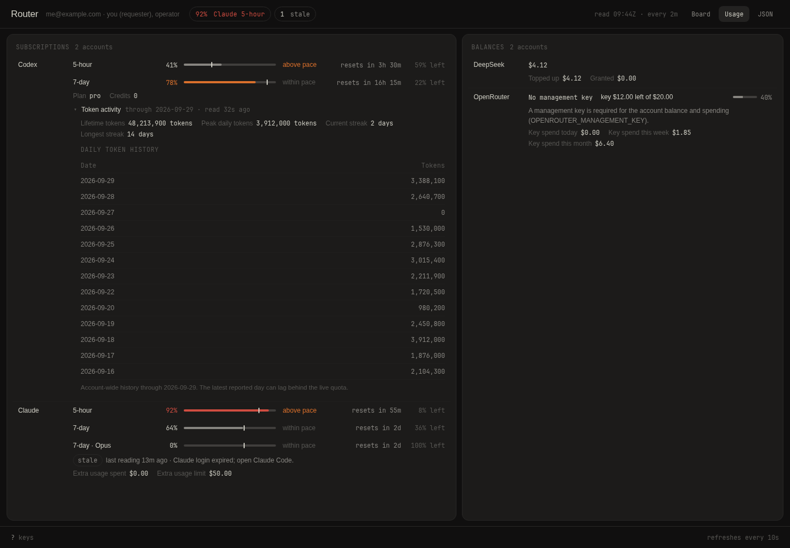

# The board

`router serve` serves the board on `serve.board` (`127.0.0.1:7678` by
default). It reads the same record as the CLI and is drawn on the server
from the [view model](board-model.md), in three columns. The pictures are
the sample board (`router/src/board.sample.json`, no live request text), the
second with one agent's sheet open; the third is the [Usage](#usage) view
of the same sample, with made-up accounts.

## The nav

The nav says who you are (cut short when long, the whole line as its
tooltip), counts what needs you, what is in flight, the held sessions and
the agents, and reads "updated 09:45Z": when the page was built. Its
tooltip gives that time and the telemetry's to the second, with their
dates, and the contract; it says "no telemetry" without a telemetry file.
`Board | Usage | JSON` ends it, the current view marked; Usage shows only
when the configuration has a [`usage`](configuration.md#usage) section.
The JSON link returns the [view model](board-model.md), usage included.

## Usage

The Usage view, at `usage/` beside the board, shows what this host's
accounts allow and have used, read with the host's own logins: Codex and
Claude (subscriptions), then DeepSeek and OpenRouter (API balances). It is
the account part of API Dash, ported into the router. `router serve` reads
the configured accounts when it starts and again `usage.every` seconds
after each read ends, one read at a time, apart from the runs; the store is
in memory only, so a restart reads afresh. `router usage` reads them once
and prints the result (see [operating.md](operating.md#usage)).

The head is the board's. Its chips name the most used subscription window
(leaving out a window whose reset has passed, and marking one from a stale
reading "· stale") and count the accounts that are stale, unavailable, or
still being read;
its tick reads "read 09:44Z · every 2m", the store's last read, with the
page's build time and the contract as its tooltip.

- **Subscriptions**: one row per quota window: the account (linked to the
  provider's usage page) on its first row, the window, the share used, a
  meter with a pace tick at how much of the window has passed, "above
  pace" when use runs more than two points ahead of it, the time to the
  reset and what is left. A window without a length or reset has no tick,
  and one whose reset has passed reads "reset passed". Colour marks only
  the 75% (warning) and 90% (error) bands and use above pace. A
  subscription that reports no window says "No quota windows reported".
- **Balances**: one row per API account, the balance leading in each
  currency the provider reports, then OpenRouter's key: what is left of
  its limit and a small meter of the share used. Balances are neutral. A
  missing OpenRouter management key reads "No management key" in the
  balance's place, with a notice naming `OPENROUTER_MANAGEMENT_KEY`; an
  account with history alone reads "Current limits are unavailable".

Under its rows, an account says how fresh it is only when it is not
current: a badge (stale, unavailable, not read) with the reading's age, and
the failure and any notice in the router's own words. A failed refresh
keeps the last reading with its time; a reading of history alone says
"Current limits are unavailable", and an account never read says "No
current reading" ("Reading…" until the first read ends). Then come the
account's other figures (plan, credits, key spend) and its history, each
behind a disclosure: Codex's token activity and, with a management key,
OpenRouter's spending by model and provider. Tables draw numbers, dates
and model and provider names in mono. A day-keyed table shows its latest
60 days and says so when it cuts; a day with no data is a gap, not a zero.
A value the provider did not report is a dash, never 0.

Below 1360px the two panels stack and the main area scrolls, since a row
of quota windows needs about 750px; at the board's 900px breakpoint each
row wraps into the screen's width, a balance on a line of its own; at
390px only a wide table scrolls sideways, inside its own box. The page
works without the script; with it, it refreshes like the board, keeps open
disclosures open (in `localStorage`), and `?` opens the help with the
palettes. The board's other keys do nothing here.

Not ported from API Dash: Claude's local statistics and its usage cache,
the macOS Keychain, Pi Atlas, the API cards' Pi spend and "balance lasts"
rows, its eight themes and a manual refresh endpoint. Claude's token comes
from Claude Code's credential file alone (`~/.claude/.credentials.json`, or
under `$CLAUDE_CONFIG_DIR`), with no variable to stand in for it, and is
never refreshed: an expired login reads "Claude login expired; open Claude
Code."

## Agents

A card per placement the router serves, saying what its session is doing
(asks on a task, with the question; works on one, including after a
question was answered, with the answer's time; delivered and not yet
replied; a send still attempting, unknown or pending; busy; held; ready;
not ready) and when it last updated. Cards come in that order, asking
first. **Busy** is a session that runs a turn the router did not send, with
no delivery and no hold: its card reads "busy" under the name and meter. A
held session stays held while it runs, and "not ready" is a session neither
ready nor running. Any other card with no open delivery collapses to its
name and state.

Each card closes with the session's health from the router's telemetry: a
pending permission by name, or the status with the turn's age (running) or
the last turn's end (idle), with `error`, `missing` and `unreachable`
dotted and the reason as a tooltip, and a dotted "error" added when the
session's attention is an error under another status; while subagents run,
the status line counts them; work that has waited too long ends the line
in the warning colour (see [Stale work](#stale-work)); a card with a
delivery adds the snapshot's age (seen); the lever that holds or releases
the session ends the row. A context meter sits in the name row (the health
row on a collapsed card) with the token counts and cost as its tooltip, in
the warning colour when the context reads stale. Provider/model, thinking and mode are on the
sheet. Without a snapshot the row reads "no telemetry".

Under the cards, the router log shows its newest line. `l` opens its last
twenty lines, newest at the bottom, and `l` again closes them; the page
keeps the choice across refreshes on that device. Without the script the
log is open.

## Stale work

The board marks work that has waited too long, in the warning colour. A
card's status line, and its sheet's, ends with the first that applies:

- "no reply 34m": the delivery's current send (the request, or the answer
  to its question) reached the session and has had no reply for more than
  30 minutes;
- "turn 18m": the session has run one turn for more than 15 minutes;
- "tool 6m": the session's last activity, a tool call, has run for more
  than 5 minutes;
- "context 86%": the context window is 80% full or more.

A task row ends with "no reply 34m" by the same rule, for any of its open
deliveries. A send not yet accepted is a wait, which the card and the row
already name, not a missing reply. The time counts from when the message
was recorded, not from when it was sent (the view model has no send time),
so a request that waited for a recipient or behind another delivery shows
its whole wait once it is sent.

## The sheet

A card's name, or `s` on the focused card, opens the placement's health
over the tasks column, the detail left whole. Its head repeats the card's
dot, name, meter, status line with the seen age and levers, then the tags
(provider/model, thinking, mode) with the host and session. Three sections
follow:

- **Checkout**, a key-value grid: project; workspace with its kind;
  directory; branch with the remote as `owner/repo` (the whole remote as
  its tooltip), "dirty" and "ahead n · behind n" when
  either is non-zero; the diff as `+a −d` or "no diff"; the pull request as
  "#n title" linked to its URL (when it is a web address) with its state
  word (draft, merged, else the state) and "conflicts" when Paseo reports
  `CONFLICTING`, then checks (failing, pending, passing, no checks, or
  unknown) and the review word; the workspace status with `active <age>`.
- **Subagents**: the non-zero counts, then the running ones as a tree one
  level deep (a child under its parent; a child whose parent is not running
  sits at the top); "none running" with counts alone, "none" with neither.
- **Activity**: the session's last eight timeline entries (the harness's
  own notices left out) oldest first, each with its clock (hh:mm:ss), kind
  word, tool and status, and text, the last one marked current, with a
  pulsing dot, when it is a running tool; the heading counts the turns
  among them, if any.

A field the router did not read says "not read"; subagents and activity add
"session not live" when the session is not idle or running. Every
placement's sheet is in the page, hidden; `esc` or its close button closes
it, a refresh keeps it open by key, and a lever pressed in it brings it back
with the page.

## Tasks and the selected task

Tasks come in three groups. **Needs you** holds the tasks that wait on one
of your principals, a finished task too when an operator must resolve its
send; **In flight** holds the other open tasks, and **Done** the last
finished ones. A row says what its task waits for: the open question, the
recipient Jev was unsure of, the delivery it is queued behind or the session
it is held on, a send not yet accepted, a delivery that has no reply yet,
the answer it was just given, or who canceled it; a row whose task has
waited too long for a reply says so last (see [Stale work](#stale-work)).

The selected task's head is one line under its title: the recipient and how
it was chosen; who sent it and when (for a task another agent sent, with
the placement it came from), the message id as its tooltip; the countdown
while it is open, or, once it is finished, how many deliveries completed,
the reason and who ended it, the deadline as its tooltip. The status badge carries the task's A2A state
as its tooltip. Below come the form that clears what waits on you, the
exchange in time order, and its deliveries, the notices its sender was
told, Jev's judgments and log.

Blue marks what needs you and nothing else: a question already answered, or
one that waits on another principal, is not blue. The selected task is in
the URL (`?task=T2`), so a reload or a shared link opens it; without one the
page opens the first task that needs you, else the newest open one, else
the newest finished one.

## Identity and actions

The board listens on loopback only, and a browser that opens it directly
gets a read-only page: every principal's waiting items, and no forms. Put
it behind Tailscale Serve to reach it from another device and to act: the
board takes the tailnet login Serve reports, and a login listed in
`serve.identities` acts as its principals (`/whoami` shows the login).

- A requester answers, chooses a recipient and cancels. Cancel shows on
  each of your open tasks; the router refuses one whose work may have
  reached a participant, and the outcome says so.
- An operator resolves a delivery the router cannot confirm. The form
  offers only the outcomes the router accepts: a send the session accepted
  can only be marked finished, and the form says so.
- Any identified login holds or releases a session. A hold says a person is
  typing in the session, so the router does not send there.

Each form posts to the board's `actions` endpoint and comes back to the page
with the outcome. `serve.board` must stay on loopback; the README's Limits
say why.

## The script

The page reads and acts without a script. Its script adds:

- a refresh every ten seconds while the tab is visible: the page fetches
  itself for the selected task and swaps the nav counts and tick, the three
  columns and the sheets. It keeps the selected task, the collapsed groups
  and the open router log (in `localStorage`), typed drafts (in
  `sessionStorage`, by their form's `data-path`), the open peek, the open
  sheet (its element, scroll and all) and the filter, and it leaves alone a
  column or a sheet that holds the focus or a text selection, so what you
  are typing or reading stays put;
- the keys. `?` opens the help, which lists them; in short, `j`/`k` move
  between task rows, space opens the peek (the row's open question with a
  reply box), `↵` opens the task or sends the peek's reply, `s` opens the
  sheet, `h` holds or releases, `l` opens or closes the router log, `a`
  goes to the answer box, `c` cancels, `/` filters, `esc` closes, and `⌘↩`
  or `Ctrl ↩` sends the form you are typing in. On a screen without a
  keyboard, the footer's `l` and `?` take a tap;
- the palettes, on the help's last row: Flexoki, light or dark with the
  system, and One Dark. The choice is kept in `localStorage` and in a
  `router-theme` cookie, so the server paints it before the script runs.
  The cookie belongs to the board's directory, so the Board and Usage tabs
  share it.

## Open items

- A post does not name its principal, so a login that holds two principals
  in one role acts as the first one `serve.identities` lists, and the
  other's items show without a form.
- A draft is keyed by its form's `data-path`, which shifts when an earlier
  item goes, and such a draft stays in storage instead of filling the moved
  form.
- The script's behaviour has no test in CI.

How the page is held to its design, and where it departs from it on
purpose, is in [`router/design/README.md`](../router/design/README.md).
