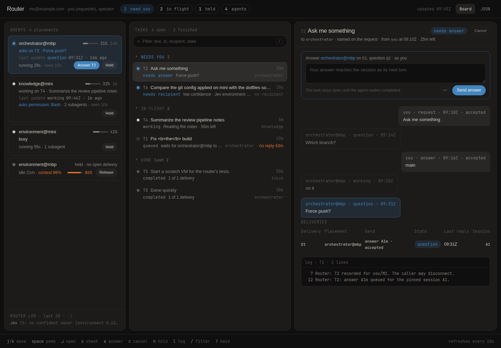

# The board

`router serve` serves the board on `serve.board` (`127.0.0.1:7678` by
default). It reads the same record as the CLI and is drawn on the server
from the [view model](board-model.md), in three columns. The pictures are
the sample board (`router/src/board.sample.json`, no live request text,
made-up accounts): as it opens, with the [usage](#usage) pop-up open, and
with one agent's sheet open.

## The nav

The nav says who you are (cut short when long, the whole line as its
tooltip), counts what needs you, what is in flight, the held sessions and
the agents, and reads "updated 09:45Z": when the page was built. Its
tooltip gives that time and the telemetry's to the second, with their
dates, and the contract; it says "no telemetry" without a telemetry file.
`Board | JSON` ends it; the JSON link returns the
[view model](board-model.md), usage included.

## Usage

With a [`usage`](configuration.md#usage) section in the configuration, the
board shows what this host's accounts allow and have used, read with the
host's own logins: Codex and Claude (subscriptions), then DeepSeek and
OpenRouter (API balances). It is the account part of API Dash, ported into
the router. When `router serve` reads the accounts, what each reads and
with which login, and `router usage`, are in
[operating.md](operating.md#usage).

**In the rail**, a Usage section stays pinned under the agent cards, above
the router log, with one two-line row per subscription account. The first
line has the provider's mark, the name, the status word (ready, stale,
unavailable, or reading until the first read ends) and, at the right, the
time to the 7-day window's reset in days and hours ("2d 10h", "16h",
"<1h", a dash once it has passed). The second has the account-wide
windows, longest first (`7D`, then `5H`), each a small meter with a tick
at how much of the window has passed, then the share used. A meter takes
the warning colour from 75% and the error colour from 90%, and the warning
colour when use runs more than two points ahead of its tick; a window
whose reset has passed keeps its share over an empty track. An account
without a window shows a dash (an ellipsis while it is read), and a stale
row is dimmed. A row's tooltip names the status, the reading's age and the
failure, each window with its pace and reset, and when usage was read.
Windows scoped to a model (`7-day · Opus`) and the balances are in the
pop-up only.

**The pop-up** opens from a row, or with `u`, beside the rail over the
tasks column, the board in view behind it; `u`, `esc`, its close button or
a click outside closes it. Its head says when usage was read and how often
("read 09:44Z · every 2m", the date in its tooltip). Both groups share one
row grid, so their columns align:

- **Subscriptions**: one row per quota window: the account on its first
  row, the window, the share used, a meter with the pace tick, "above
  pace" in the warning colour, and the time to the reset with its date as
  the tooltip. The figure and the meter take the 75% and 90% colours. A
  window whose reset has passed reads "reset passed", dimmed, with no tick
  and no colour. A subscription that reports no window says "No quota
  windows reported".
- **Balances**: one row per balance the provider reports, in its currency,
  then OpenRouter's key: what is left, a meter of the allowance used and
  "of" its limit. Balances are never coloured. A missing OpenRouter
  management key reads "No management key" in the balance's place, with
  the notice naming `OPENROUTER_MANAGEMENT_KEY` as its tooltip; an account
  with history alone reads "Current limits are unavailable".

An account that is not current carries a badge (stale, unavailable) and a
status line: the reading's age, or the last check's, and the failure in the
router's own words. A failed refresh keeps the last reading with its time;
an account never read says "No current reading" ("Reading…" until the
first read ends). An account's name opens its details: its other figures
(plan, credits, key spend), the reading's notice, a link to the provider's
usage page, and its history: Codex's token activity and, with a management
key, OpenRouter's spending by model and provider. Tables draw numbers,
dates and model and provider names in mono, as wide as their content. A
day-keyed table lists every calendar day, newest first, the latest 14 with
the rest behind "all n days"; a day with no data is a gap row with a dash,
not a zero, and a table with one numeric column draws a bar beside it. A
value the provider did not report is a dash, never 0.

From 900px down the pop-up is the page, each row wrapping into the
screen's width, and a wide table scrolls sideways inside its own box.
Without a script a rail row is a link to the page with the pop-up drawn
open (`?usage`) and every account's details shown, and the close button,
like a row while the pop-up is open, a link back; `usage/`, the old Usage tab's address, redirects there. With
the script the pop-up opens in place and stays open across a refresh, and
an account's details or a table's older days stay open on that device (in
`localStorage`).

Not ported from API Dash: Claude's local statistics and its usage cache,
the macOS Keychain, Pi Atlas, the API cards' Pi spend and "balance lasts"
rows, its eight themes, a manual refresh endpoint and the refresh of
Claude's token (see [operating.md](operating.md#usage)).

## Agents

A card per placement the router serves, saying what its session is doing
(asks on a task, with the question; works on one, including after a
question was answered, with the answer's time; delivered and not yet
replied; a send still attempting, unknown or pending; busy; held; ready;
not ready) and when it last updated. Cards come in that order, asking
first. **Busy** is a session that runs a turn the router did not send, with
no delivery and no hold: its card reads "busy" under the name and meter. A
held session stays held while it runs, and "not ready" is a session neither
ready nor running. Any other card with no open delivery collapses to its
name and state.

Each card closes with the session's health from the router's telemetry: a
pending permission by name, or the status with the turn's age (running) or
the last turn's end (idle), with `error`, `missing` and `unreachable`
dotted and the reason as a tooltip, and a dotted "error" added when the
session's attention is an error under another status; while subagents run,
the status line counts them; work that has waited too long ends the line
in the warning colour (see [Stale work](#stale-work)); a card with a
delivery adds the snapshot's age (seen); the lever that holds or releases
the session ends the row. A context meter sits in the name row (the health
row on a collapsed card) with the token counts and cost as its tooltip, in
the warning colour when the context reads stale. Provider/model, thinking and mode are on the
sheet. Without a snapshot the row reads "no telemetry".

Under the cards, and under the [Usage](#usage) section when there is one,
the router log shows its newest line. `r` opens its last twenty lines,
newest at the bottom, and `r` again closes them; the page keeps the choice
across refreshes on that device. Without the script the log is open.

## Stale work

The board marks work that has waited too long, in the warning colour. A
card's status line, and its sheet's, ends with the first that applies:

- "no reply 34m": the delivery's current send (the request, or the answer
  to its question) reached the session and has had no reply for more than
  30 minutes;
- "turn 18m": the session has run one turn for more than 15 minutes;
- "tool 6m": the session's last activity, a tool call, has run for more
  than 5 minutes;
- "context 86%": the context window is 80% full or more.

A task row ends with "no reply 34m" by the same rule, for any of its open
deliveries. A send not yet accepted is a wait, which the card and the row
already name, not a missing reply. The time counts from when the message
was recorded, not from when it was sent (the view model has no send time),
so a request that waited for a recipient or behind another delivery shows
its whole wait once it is sent.

## The sheet

A card's name, or `s` on the focused card, opens the placement's health
over the tasks column, the detail left whole. Its head repeats the card's
dot, name, meter, status line with the seen age and levers, then the tags
(provider/model, thinking, mode) with the host and session. Three sections
follow:

- **Checkout**, a key-value grid: project; workspace with its kind;
  directory; branch with the remote as `owner/repo` (the whole remote as
  its tooltip), "dirty" and "ahead n · behind n" when
  either is non-zero; the diff as `+a −d` or "no diff"; the pull request as
  "#n title" linked to its URL (when it is a web address) with its state
  word (draft, merged, else the state) and "conflicts" when Paseo reports
  `CONFLICTING`, then checks (failing, pending, passing, no checks, or
  unknown) and the review word; the workspace status with `active <age>`.
- **Subagents**: the non-zero counts, then the running ones as a tree one
  level deep (a child under its parent; a child whose parent is not running
  sits at the top); "none running" with counts alone, "none" with neither.
- **Activity**: the session's last eight timeline entries (the harness's
  own notices left out) oldest first, each with its clock (hh:mm:ss), kind
  word, tool and status, and text, the last one marked current, with a
  pulsing dot, when it is a running tool; the heading counts the turns
  among them, if any.

A field the router did not read says "not read"; subagents and activity add
"session not live" when the session is not idle or running. Every
placement's sheet is in the page, hidden; `esc` or its close button closes
it, a refresh keeps it open by key, and a lever pressed in it brings it back
with the page.

## Tasks and the selected task

Tasks come in three groups. **Needs you** holds the tasks that wait on one
of your principals, a finished task too when an operator must resolve its
send; **In flight** holds the other open tasks, and **Done** the last
finished ones. A row says what its task waits for: the open question, the
recipient Jev was unsure of, the delivery it is queued behind or the session
it is held on, a send not yet accepted, a delivery that has no reply yet,
the answer it was just given, or who canceled it; a row whose task has
waited too long for a reply says so last (see [Stale work](#stale-work)).

The selected task's head is one line under its title: the recipient and how
it was chosen; who sent it and when (for a task another agent sent, with
the placement it came from), the message id as its tooltip; the countdown
while it is open, or, once it is finished, how many deliveries completed,
the reason and who ended it, the deadline as its tooltip. The status badge carries the task's A2A state
as its tooltip. Below come the form that clears what waits on you, the
exchange in time order, and its deliveries, the notices its sender was
told, Jev's judgments and log.

Blue marks what needs you and nothing else: a question already answered, or
one that waits on another principal, is not blue. The selected task is in
the URL (`?task=T2`), so a reload or a shared link opens it; without one the
page opens the first task that needs you, else the newest open one, else
the newest finished one. A task opens in place: its row is marked at once
and its detail swapped in, and the URL follows.

The facts tables (deliveries, notices and Jev's judgments) are tables on a
wide screen. At 1180px and less each row becomes a record: the key cells on
its first line (a delivery's id, placement and state), the rest labelled on
the second. A delivery's send reads as its kind, its message id
(an id over twelve characters cut to eight, the whole id as its tooltip)
and its outcome.

## Widths

From 1279px down a card's status takes its own line. From 901px to 1180px
the rail is a fixed 272px column, the tasks and the detail share the rest,
and an open sheet, at least 320px wide, may spill over the detail. A task
row's second line wraps when it is too narrow for its text and
recipients, and a sheet's row when it is too narrow for its parts; a name
too long for its line ends in an ellipsis, whole in its tooltip. From
900px down the page is one column that scrolls: the rail with its Usage
section, the tasks, then the detail. The sheet, the usage pop-up and the
peek take the screen's width, and the key line keeps only what a tap can
do: `r` and `?`.

## Identity and actions

The board listens on loopback only, and a browser that opens it directly
gets a read-only page: every principal's waiting items, and no forms. Put
it behind Tailscale Serve to reach it from another device and to act: the
board takes the tailnet login Serve reports, and a login listed in
`serve.identities` acts as its principals (`/whoami` shows the login).

- A requester answers, chooses a recipient and cancels. Cancel shows on
  each of your open tasks; the router refuses one whose work may have
  reached a participant, and the outcome says so.
- An operator resolves a delivery the router cannot confirm. The form
  offers only the outcomes the router accepts: a send the session accepted
  can only be marked finished, and the form says so.
- Any identified login holds or releases a session. A hold says a person is
  typing in the session, so the router does not send there.

Each form posts to the board's `actions` endpoint and comes back to the page
with the outcome. `serve.board` must stay on loopback; the README's Limits
say why.

## The script

The page reads and acts without a script. Its script adds:

- a refresh every ten seconds while the tab is visible: the page fetches
  itself for the selected task and swaps the nav counts and tick, the three
  columns, the sheets and the usage pop-up. It keeps the selected task, the
  collapsed groups, the open router log and the open usage details (in
  `localStorage`), typed drafts (in `sessionStorage`, by their form's
  `data-path`), the open peek, the open sheet and the open pop-up (each its
  element, scroll and all) and the filter, and it leaves alone a column, a
  sheet or the pop-up that holds the focus or a text selection, so what you
  are typing or reading stays put;
- opening a task in place: a link to a task (a row's id, a card's task, the
  peek's Open task, an Answer lever) fetches the page for that task and
  swaps in its detail, whatever the detail holds, and an Answer lever then
  goes to its form. The link joins the history as if it had been followed,
  so Back returns to the task before it. No refresh starts while the fetch
  is on its way. A fetch that fails follows the link, and a click with a
  modifier key keeps the browser's own;
- the keys. `?` opens the help, which lists them; in short, `↑`/`↓` move
  between task rows (from a row, a card or nothing in particular: on a
  button, a link or a scrolling table they scroll as usual, and so does
  `⇧` with an arrow), `↵` or `→` opens the focused task (or the focused
  card's sheet), and `←` or `esc` goes back: it closes the help, then the
  usage, then the peek, then the sheet. Space opens the peek (the row's
  open question with a reply box), where `↵` sends the reply; `s` opens the
  sheet, `a` goes to the answer box, `c` cancels, `p` holds or releases,
  `r` opens or closes the router log, `u` opens or closes the usage, `/`
  filters, and `⌘↩` or `Ctrl ↩` sends the form you are typing in. In the
  usage pop-up `↑`/`↓` move between the accounts, `→` or `↵` opens the
  focused account's details, and `←` closes them, or the pop-up when they
  are shut; with the help open over it, `←` closes the help. A key that ends an IME composition (a Hangul syllable, a kana
  conversion) is left to the text. On a screen without a keyboard, the
  footer's `r` and `?` take a tap;
- the palettes, on the help's last row: Flexoki, light or dark with the
  system, and One Dark. The choice is kept in `localStorage` and in a
  `router-theme` cookie, so the server paints it before the script runs.
  The cookie belongs to the board's directory, the page's only address.

## Open items

- A post does not name its principal, so a login that holds two principals
  in one role acts as the first one `serve.identities` lists, and the
  other's items show without a form.
- A draft is keyed by its form's `data-path`, which shifts when an earlier
  item goes, and such a draft stays in storage instead of filling the moved
  form.
- The script's behaviour has no test in CI; `src/board-check.ts` checks it
  in a local Chromium (see `router/design/README.md`).
- The first request after `router serve` starts replays the whole journal
  (about 2 s on a record of 1,600 lines), and so does one after the
  journal is cut back or replaced; after that a request folds only the
  lines appended since.

How the page is held to its design, and where it departs from it on
purpose, is in [`router/design/README.md`](../router/design/README.md).
